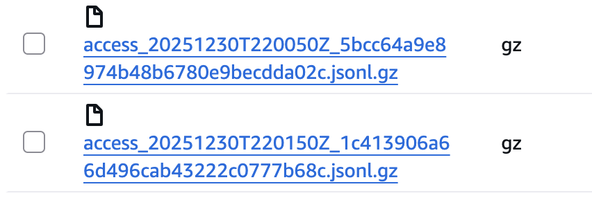
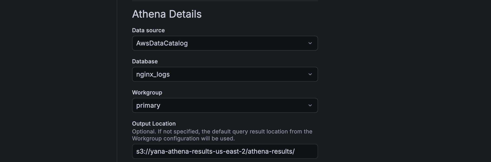

# Nginx Logs → S3 → Athena → Grafana

**Nginx** generates structured access logs, which are incrementally shipped to **Amazon S3**.
Logs are queried with Amazon Athena and visualized in Grafana.

## Flow 🐳:
```
traffic-gen → nginx → access.log → log-shipper → S3 → Athena → Grafana
```
- **nginx** - receives HTTP requests and writes JSON access logs
- **traffic-gen** - Python container generating synthetic HTTP traffic
- **log-shipper** - tails nginx access logs and uploads incremental chunks to S3
- **Amazon S3** - durable storage for log data
- **Amazon Athena** - SQL queries over logs stored in S3
- **Grafana** - dashboards built on top of Athena queries

## Project structure

```
nginx_logs/
├── docker-compose.yml
├── .env
├── .gitignore
├── nginx/
│   └── nginx.conf
├── traffic-gen/
│   ├── Dockerfile
│   └── gen.py
├── log-shipper/
│   ├── Dockerfile
│   └── ship.py
├── athena/
│   └── athena.sql
└── README.md
```

## Log format
Nginx writes one JSON object per request (`JSON Lines`):
```
{
  "ts": "2025-01-10T14:31:02+00:00",
  "remote_addr": "172.18.0.3",
  "method": "GET",
  "path": "/api/orders?page=1",
  "status": 200,
  "bytes_sent": 512,
  "request_time": 0.023,
  "user_agent": "Mozilla/5.0",
  "session_id": "abc123"
}
```
## S3 layout
Logs are uploaded in near-realtime batches (default: every 60 seconds) and partitioned by time:
```
s3://<bucket>/<prefix>/
  year=YYYY/
    month=MM/
      day=DD/
        hour=HH/
          access_YYYYMMDDTHHMMSSZ_<uuid>.jsonl.gz
```

# How to install  😎

### 🟦 1. Prerequisites

Before starting, ensure the following tools are installed locally:

- Docker (v24+ recommended)
- Docker Compose (v2)
- AWS account with access to S3 and Athena
- S3 bucket
- AWS credentials configured locally (~/.aws/credentials)

The project was tested on macOS

### 🟥 2. Prepare AWS credentials

- Prepare AWS credentials `ls ~/.aws`
- Expected files: `config` , `credentials` 

The log-shipper container mounts this directory read-only and uses it via `boto3`

##

### ❗️❗️❗️ 
### The project requires an IAM user or role with permissions to write logs to S3 and query them via Athena
### Attach the following AWS-managed policies:

- `AmazonS3FullAccess`
- `AmazonAthenaFullAccess`
- `AWSGlueReadOnlyAccess`
##

### 🟥 3. Configure environment variables
Create a `.env` file in the project root (next to `docker-compose.yml`):
```
AWS_REGION=
S3_BUCKET=
S3_PREFIX=

LOG_PATH=/var/log/nginx_files/access.jsonl
STATE_PATH=/var/log/nginx_files/.shipper_state.json
```
### 🟩 4. Build and start services
From the project root:
```
docker compose up --build
```
This will:
- build custom images (traffic-gen, log-shipper)
- start nginx, Grafana, and supporting containers
- begin generating traffic automatically

### 🟩 5. Verify log shipping
Within 1–2 minutes, verify that objects appear in S3:
```
s3://<bucket>/<prefix>/year=YYYY/month=MM/day=DD/hour=HH/
```
You should see multiple `.jsonl.gz` files per hour.


- Check `log-shipper` container logs
- Example log output:
```
INFO | uploaded s3://nginx-logs-s3-grafana-dev/nginx_access_logs/year=2025/month=01/day=10/hour=14/... lines=182 bytes_gz=48123
```

### 🟦 6. Athena setup
- **Athena** is used as a SQL query engine over S3.
- **Grafana** will query Athena, not S3 directly.
- Create db / table / partitions with `athena/athena.sql`

### 🟥 7. Grafana setup

- Open **Grafana** `http://localhost:3000` (Credentials are defined in `docker-compose.yml`)
- **Add Athena datasource:** Settings → Data sources → Add data source → Select Amazon Athena

**Configuration:**
- Region: same as S3 / Athena
- Authentication: Default AWS SDK
- Catalog: AwsDataCatalog
- Database: nginx_logs
- Output location: `s3://<bucket>/athena-results/`




### 🟩 8.Dashboard panel

Example query:
```
SELECT
  CASE
    WHEN status BETWEEN 200 AND 299 THEN 'success'
    WHEN status IN (401, 403, 404) THEN 'expected errors'
    WHEN status >= 500 THEN 'server errors'
    ELSE 'other'
  END AS result,
  COUNT(*) AS requests
FROM nginx_logs.access_logs
WHERE from_iso8601_timestamp(ts) >= now() - interval '30' minute
GROUP BY 1
ORDER BY 2 DESC;
```


# Problems

## Why offset-based tailing is required

Nginx appends access logs to a single, continuously growing file (append-only under normal operation).
Because of this write pattern, the shipper must avoid rereading the file from the beginning on every cycle, otherwise it would upload duplicate data. The shipper therefore uses **offset-based tailing**.

The `log-shipper` maintains a persistent byte offset in a small state file.

On each polling cycle:
- open the log file
- `seek(offset)`
- read only newly appended bytes
- split the chunk into log lines
- buffer lines in memory
- update offset to the current end-of-file position

The offset is persisted so that restarts do not cause rereads and duplicate uploads.

## Nginx Docker image symlink caveat

In the default official nginx image, `/var/log/nginx/access.log` is often a symlink to `/dev/stdout` (and `error.log` to `/dev/stderr`). This is an expected container-logging pattern, but it breaks file-based tailing because `/dev/stdout` is not seekable.

Impact:
- `seek(offset)` fails or behaves unpredictably
- **offsets** cannot be maintained reliably
- incremental tailing may break or cause duplicates

### Resolution

To make tailing deterministic, nginx is configured to write access logs to **a real file (not stdout)**, backed by a shared Docker volume:
```
access_log /var/log/nginx_files/access.jsonl access_json;
```

This guarantees that:
- the log target is a regular file (not a symlink)
- file offsets are stable
- incremental tailing behaves predictably